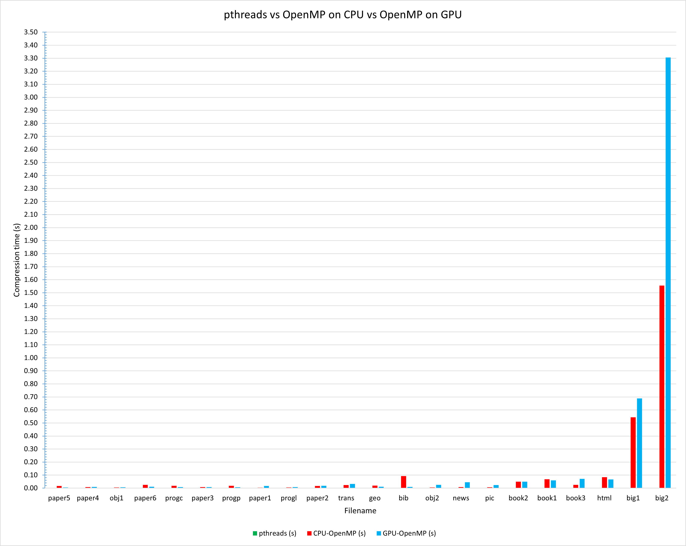

# DREAM Parallel LZO Compression

As a part of the DREAM project titled "Parallelization of data compression on different parallel processing systems" we have implemented LZO compression algorithm on POSIX threads. The project is done under the guidance of Associate Professor Dr. A. Özsoy at the Department of Computer Engineering, Hacettepe University, Ankara, Turkey.

## LZO Compression Algorithm

LZO is a data compression algorithm that is focused on decompression speed. It is similar to the LZ77 algorithm published by Abraham Lempel and Jacob Ziv in 1977, and features a high decompression speed at the cost of a compression ratio that is lower than that of algorithms with a slower decompression speed. LZO is distributed under the GNU General Public License.

## LZO Compression Algorithm Implementation

The LZO compression algorithm is implemented using pthreads, OpenMP, and CUDA. OpenMP and CUDA implementations use same code, however, they are compiled with different compilers. The pthreads implementation is done using the lzo1x_1_compress function provided by the LZO library. The compression and decompression times are measured for each of the implementations.

In this project, we aimed to increase the compression speed by using multiple threads. The implementation is done using 8 threads, as we have found out that using more than 8 threads does not increase the compression speed significantly.

## Results and Analysis

We used Calgary Corpus, the same collection of files that the original LZO algorithm is tested with, and 4 other files in bigger sizes to test our parallel algorithm.

### pthreads Implementation

| **Filename** | **Filesize (KB)** | **pthreads (s)** | **CPU-OpenMP (s)** | **GPU-OpenMP (s)** |
|:-------------|:-----------------:|:----------------:|:------------------:|:------------------:|
| **paper5**   |       12.0        |     0.001202     |      0.017208      |      0.005391      |
| **paper4**   |       13.3        |     0.001239     |      0.007433      |      0.008695      |
| **obj1**     |       21.5        |     0.001099     |      0.004458      |      0.006243      |
| **paper6**   |       38.1        |     0.001172     |      0.024814      |      0.011016      |
| **progc**    |       39.6        |     0.001001     |      0.017380      |      0.008164      |
| **paper3**   |       46.5        |     0.001180     |      0.007853      |      0.007984      |
| **progp**    |       49.4        |     0.000993     |      0.017281      |      0.006672      |
| **paper1**   |       53.2        |     0.000929     |      0.003771      |      0.016299      |
| **progl**    |       71.6        |     0.000997     |      0.004317      |      0.007560      |
| **paper2**   |       82.2        |     0.001209     |      0.015878      |      0.018083      |
| **trans**    |       93.7        |     0.001569     |      0.024100      |      0.031704      |
| **geo**      |       102.4       |     0.001176     |      0.019318      |      0.010592      |
| **bib**      |       111.3       |     0.001270     |      0.093035      |      0.009815      |
| **obj2**     |       246.8       |     0.000949     |      0.005589      |      0.025478      |
| **news**     |       377.1       |     0.001141     |      0.008193      |      0.044720      |
| **pic**      |       513.2       |     0.001044     |      0.006475      |      0.023364      |
| **book2**    |       610.9       |     0.000981     |      0.048879      |      0.050243      |
| **book1**    |       768.8       |     0.000882     |      0.068029      |      0.059235      |
| **book3**    |       807.2       |     0.001029     |      0.025111      |      0.071348      |
| **html**     |      1157.9       |     0.000912     |      0.083651      |      0.067338      |
| **big1**     |      6488.7       |     0.001337     |      0.544062      |      0.688344      |
| **big2**     |     169492.9      |     0.001337     |      1.555344      |      3.305254      |


### Overall Compression Time Comparison

As it can be seen in the graph and table below, pthread implementation of LZO compression algorithm is faster than the other two implementations and has a much higher throughput.

|    **Method**     | **Throughput (KB/s)** |
|:-----------------:|:---------------------:|
|   **pthreads**    |        6222175        |
| **OpenMP on CPU** |       19376.82        |
| **OpenMP on GPU** |       10200.82        |



### To Run the Code

1. Clone the repository
2. Install LZO library
3. Extract Dataset.zip to the code directory
4. Run the following commands in the directory where the repository is cloned 
   1. For pthreads
    ```
    gcc -o lzo-pthread lzo-pthread.c -llzo2 -lpthread
    ./lzo-pthread
    ```
   2. For OpenMP on CPU
    ```
    gcc -o lzo-openmp lzo-openmp.c -llzo2 -fopenmp
    ./lzo-openmp
    ```
   3. For OpenMP on GPU
    ```
    nvc -o lzo-cuda lzo-openmp.c -mp=gpu -gpu=cc70 -llzo2 -fopenmp
    ./lzo-cuda
    ```


#### Note

To change the number of threads, change the value of the thread_count variable in the code. The default value is 8.
